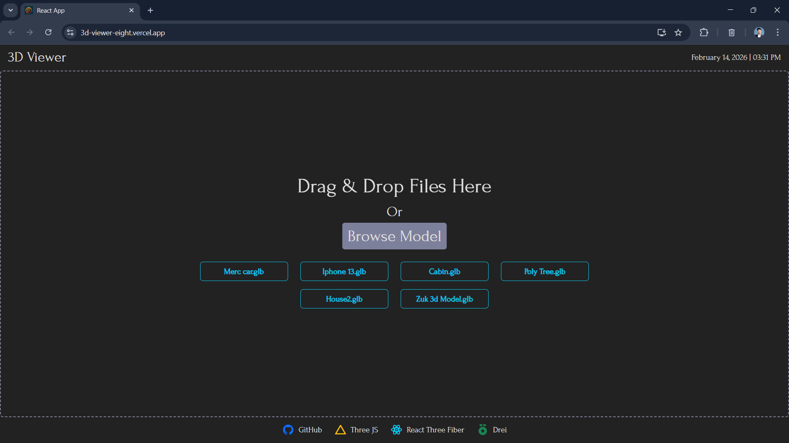
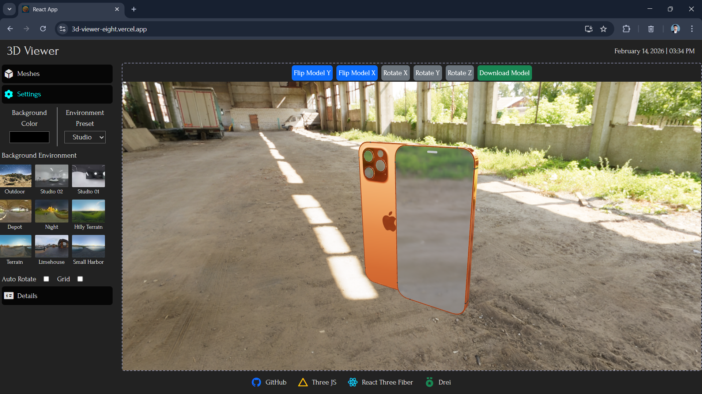

# 🚀 3D Model Viewer – Interactive Web-Based 3D Exploration Tool

🌐 **Live Demo:** https://3d-viewer-eight.vercel.app  
📂 **Repository:** https://github.com/Omkarkumbhar47/3D-Viewer  
👨‍💻 **Author:** Omkar Kumbhar

---

## 📌 Overview

A powerful **browser-based 3D Model Viewer** built using **React, Three.js, and React Three Fiber** that allows users to load, explore, and interact with 3D models in real time.

This application focuses on performance, usability, and intuitive model interaction, making it suitable for engineering previews, product visualization, and design inspection workflows.

---

## 🎯 Problem Statement

Traditional 3D model inspection tools often require heavy desktop software and complex installations.
This project solves that by providing a **lightweight, responsive, and interactive web-based 3D viewer** that runs directly in the browser.

---

## 📸 Screenshots

### 🧊 3D Model Viewer Interface




### 💡 Lighting & Environment Settings




## ✨ Key Features

### 🧊 3D Model Interaction

* Drag & drop 3D model upload
* Real-time rendering using WebGL
* Click-to-select model parts
* Highlight selected meshes with visual feedback
* Seamless canvas ↔ sidebar synchronization

### 🧭 Model Structure Explorer

* Traverse model hierarchy
* Toggle mesh visibility
* Select and highlight individual parts
* Bi-directional sync between UI & canvas

### 💡 Lighting & Environment Controls

* Adjustable lighting for better visualization
* Background color customization
* Environment presets

### 📸 Snapshot Tool

Capture high-quality screenshots of the 3D canvas:

* Small → 1280×720
* Medium → 1920×1080
* Large → 2560×1440
* Custom resolution support
* Optional transparent background

### 📱 Responsive Layout

* Dynamic header & footer sizing
* Fully responsive canvas
* Adaptive sidebar behavior
* Clean and modern UI

---

## 🛠️ Tech Stack

**Frontend**

* React.js
* React Three Fiber
* Three.js
* Drei
* Bootstrap

**Rendering**

* WebGL-based real-time 3D rendering

**UI**

* Custom typography (ForumRegular)
* Responsive component architecture

---

## 📂 Project Structure

```
3D-Viewer/
│
├── public/                  # Static assets
│
├── src/
│   ├── components/          # Reusable UI + 3D viewer components
│   │   ├── Header/
│   │   ├── Footer/
│   │   ├── Sidebar/
│   │   └── ModelViewer/
│   │
│   ├── utils/               # Helper functions (lighting, canvas logic, etc.)
│   │   └── lightingHelper.js
│   │
│   ├── fonts/               # Custom fonts
│   │   └── Forum-Regular.ttf
│   │
│   ├── assets/              # Images & static resources
│   │   └── 3dLogo.jpg
│   │
│   ├── App.js               # Root component
│   ├── App.css              # Global styles
│   ├── index.js             # Entry point
│   ├── index.css            # Base styling
│   └── reportWebVitals.js   # Performance monitoring
│
├── .gitignore
├── package.json
├── package-lock.json
└── README.md
```


---

## 🚀 Getting Started

### 1️⃣ Clone the Repository

```bash
git clone https://github.com/Omkarkumbhar47/3D-Viewer.git
cd 3D-Viewer
```

### 2️⃣ Install Dependencies

```bash
npm install
```

### 3️⃣ Run the Application

```bash
npm start
```

---

## 🧪 How to Use

1. Upload a 3D model via drag & drop or file input
2. Explore model parts from the sidebar
3. Toggle visibility of meshes
4. Adjust lighting & environment
5. Capture high-resolution snapshots

---

## 🧠 Key Learnings

* Implemented real-time 3D rendering in React
* Managed complex state syncing between UI and WebGL canvas
* Optimized performance for large models
* Built scalable component architecture
* Improved UX for technical visualization tools

---

## 🚧 Future Enhancements

* Animation controls for models
* Support for additional file formats
* Camera preset saving
* Dark/light theme toggle
* Export model metadata

---

## 🤝 Contributing

Contributions are welcome!

If you're interested in:

* WebGL & 3D rendering
* UI/UX improvements
* Performance optimization

Feel free to fork the repo and submit a PR 🚀

---

## 🔗 Connect With Me

* Portfolio: https://v2-portfolio-navy.vercel.app/
* LinkedIn: https://linkedin.com/in/omkar-kumbhar-291168259/
* Email: [kumbharomkar747@gmail.com](mailto:kumbharomkar747@gmail.com)

---

## 📄 License

This project is licensed under the MIT License.
